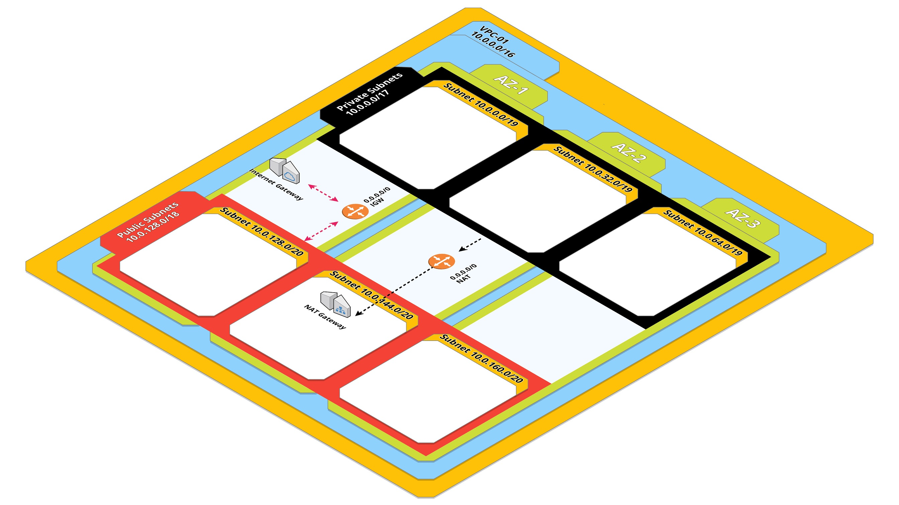

# terraform-aws

This repository contains a [Terraform][] project that builds a VPC
with Public and Private Subnets in three different availability zones along with associated NAT, Internet Gateway and two Windows 2019 based domain controllers within different private subnets. CloudWatchAgent is also installed on domain controllers and configured with alarms for monitoring purposes. See bellow for full feature list.

### Features

- VPC
- 3x Public and 3x Private Subnets
- IGW and NAT
- Domain Controller security group
- 2x EC2 instance (domain controllers) launch within private subnets
- 2x S3 bucket creation for CloudTrail and CloudWatch monitoring
- Upload of CloudWatch Agent configuration files to AWSMonitoring S3 bucket
- CloudTrail configuration
- SNS Topic creation for warning and critical alerts
- CloudWatch Monitoring alerts for CPU, Memory & Disk Space

### Info

- Subscription to SNS topics is a manual process (e.g. helpdesk email address subscription for alerts)

### Deployment

#### Initialise
```
terraform init
```

#### Plan

```
terraform plan -out execution-plan
```

#### Apply

```
terraform apply "execution-plan"
```

#### Destroy

```
terraform destroy
```

### Backlog

- Enable VPC Flow Logs
- Configure AWS Backup
- Automatic updates and patching via AWS Systems Manager
- Implement CI/CD via AWS CodeBuild

## Infrastructure Diagram



## Author

2019 Nick Germi <nick@emz.com.au>.

[Terraform]: http://terraform.io
